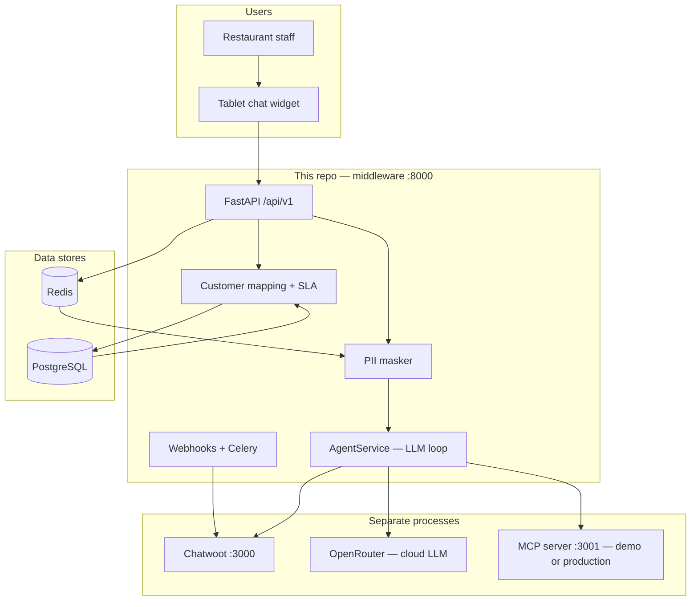

# ButterPOS Agent — Beginner’s Guide (What, Why, Where, How)

A step-by-step guide to understand this repository without reading every file first.

**You are here:** `ButterPOS-Agent` is the **middleware** (the “brain”) for an AI support agent on restaurant POS tablets. It does **not** replace Chatwoot, the Android app, or the ButterPOS backend — it connects them.

---

## 1. What is this project?

| Question | Answer |
|----------|--------|
| **What** | A Python **FastAPI** service that receives customer/staff chat messages, runs an **AI agent** (LLM + tools), and replies through **Chatwoot** (ticketing). |
| **Who talks to it** | Tablet **chat widget** (React/Kotlin), or the local test UI at `/api/v1/chat/ui`. |
| **What it does not do** | It does not host the POS database, print receipts, or run the full ButterPOS app. |

**One sentence:** Staff ask “printer not working” or “biryani price?” → middleware masks PII, asks the LLM, calls **MCP tools** on the POS side, then sends a helpful reply in **English or Roman Urdu**.

---

## 2. Why does this exist?

Restaurant support today is often WhatsApp + humans. This project automates **Tier 1** support:

- Read menu, printer status, sales (via MCP tools)
- Fix simple issues when allowed (e.g. restart printer workflow)
- Escalate to a human when needed (Chatwoot)

The middleware exists so you can **swap vendors** without rewriting everything:

- Chatwoot today, Zoho later → same `TicketingProvider` interface
- OpenAI / Claude / Gemini → same `LLMProvider` via **OpenRouter**
- New POS tools → MCP server adds tools; middleware stays a **client**

---

## 3. Big picture (five parts)



| # | Part | Who owns it | Role |
|---|------|-------------|------|
| 1 | **Chat widget** | Android / frontend team | UI on tablet; calls middleware API with JWT |
| 2 | **Middleware** | **This repo** | Auth, mapping, AI loop, PII, webhooks, persistence |
| 3 | **Chatwoot** | DevOps / you (Docker) | Tickets, conversations, human agents |
| 4 | **LLM (OpenRouter)** | Paid API | “Thinking” and tool-call decisions |
| 5 | **MCP server** | Backend teammate (demo: `demo/pos_mcp/`) | Real POS actions: menu, printer, sales |

---

## 4. Step by step — one chat message

Follow what happens when staff send: *“Printer offline hai, help karo”*.

### Step 1 — User sends message

| Where | What happens |
|-------|----------------|
| **Widget or** `http://127.0.0.1:8000/api/v1/chat/ui` | Browser/app sends `POST /api/v1/chat/messages` with JWT |
| **File** | `app/api/v1/chat.py` → `app/services/chat_service.py` |

**Why JWT?** So only your app can call the API (`API_CLIENT_ID` / `API_CLIENT_SECRET` in `.env`).

### Step 2 — Optional: who is this customer?

| Where | What happens |
|-------|----------------|
| **`app/services/mapping/`** | Resolve `butterpos_user_id` → branch → restaurant → plan → SLA |
| **Postgres** | Tables: `users`, `branches`, `restaurants`, `sla_config` |
| **Output** | `max_agent_tier` (1 = read-only only, 3 = full playbook) |

**Why?** Unpaid plan, expired plan, or outside support hours → agent must not auto-fix (Tier 1 only). See `app/services/mapping/evaluator.py` and D-15 in `DECISIONS.md`.

### Step 3 — PII masking (mandatory)

| Where | What happens |
|-------|----------------|
| **`app/core/pii/`** | Phone, email, card numbers → tokens like `[PII:PHONE:abc123]` |
| **Redis** | Stores real values 24h so replies can be unmasked for the user |
| **Why** | Data goes to **paid cloud LLMs**; secrets must not leave your control in clear text |

### Step 4 — Agent loop (LLM + tools)

| Where | What happens |
|-------|----------------|
| **`app/services/agent_service.py`** | Builds messages, calls OpenRouter with tool definitions |
| **LLM** | Decides: “call `troubleshoot_printer`” |
| **`app/core/mcp/client.py`** | Calls MCP server at `MCP_SERVER_URL` (e.g. `http://127.0.0.1:3001/mcp`) |
| **Demo MCP** | `demo/pos_mcp/server.py` runs 4-step printer workflow (check → IP/pairing → restart → verify) |
| **Loop** | Up to `AGENT_MAX_TOOL_ROUNDS` (default 6) tool rounds until LLM writes final text |

**Why MCP?** LLM never talks to the database directly; tools are explicit and auditable (D-4).

### Step 5 — Language of reply

| Where | What happens |
|-------|----------------|
| **System prompt** in `agent_service.py` | Instructs: reply in **same language** as user (English, Roman Urdu, or mixed) |
| **Why** | Tool JSON is often English; prompt tells model to explain in Roman Urdu to the user (D-5) |

### Step 6 — Response back

| Where | What happens |
|-------|----------------|
| **PII unmask** | Tokens in reply replaced with real phone/email for display |
| **API response** | `{ "reply": "...", "tool_calls": [...] }` |
| **Optional Chatwoot path** | Webhook → Celery → same agent → `add_comment` on ticket |

---

## 5. Each building block — what, why, where, how

### FastAPI (middleware, port 8000)

| | |
|-|-|
| **What** | Python web framework; exposes REST API under `/api/v1/`. |
| **Why** | Async, fast, good for webhooks + LLM I/O. |
| **Where** | `app/main.py`, `app/api/v1/*.py` |
| **How** | `uvicorn app.main:app --reload --port 8000` → OpenAPI at `/docs` |

### PostgreSQL

| | |
|-|-|
| **What** | Main database for restaurants, branches, users, SLA, ticket cache, chat sessions, webhook log. |
| **Why** | Durable truth; survives restarts; audit trail. |
| **Where** | `app/db/models/`, migrations in `alembic/versions/` |
| **How** | `docker compose up -d` → `alembic upgrade head` → `DATABASE_URL` in `.env` |

### Redis

| | |
|-|-|
| **What** | In-memory store for fast ephemeral data. |
| **Why** | PII token map (24h), rate limits, ticket/contact cache, Celery broker, webhook DLQ. |
| **Where** | `app/core/pii/`, `app/core/cache/`, `app/core/rate_limit/`, `app/core/dedup/` |
| **How** | `docker compose up -d` → `REDIS_URL` in `.env` |

### Chatwoot (port 3000)

| | |
|-|-|
| **What** | Open-source helpdesk (tickets, agents, inbox). |
| **Why** | System of record for conversations; humans take over when AI escalates. |
| **Where** | `app/providers/ticketing/chatwoot/` — implements `TicketingProvider` |
| **How** | Separate Docker; `CHATWOOT_*` in `.env`; webhooks to `/api/v1/webhooks/chatwoot` |

**Important:** Core code never `import chatwoot` SDK — only the adapter (D-1).

### OpenRouter (LLM)

| | |
|-|-|
| **What** | API gateway to models (`openai/gpt-4o`, Claude, Gemini, etc.). |
| **Why** | One key, swap models via config, no vendor SDK in core (D-3, D-11). |
| **Where** | `app/providers/llm/openrouter.py` |
| **How** | `OPENROUTER_API_KEY`, `LLM_PRIMARY_MODEL` in `.env` |

### MCP server (port 3001 in local demo)

| | |
|-|-|
| **What** | Separate process exposing **tools** (menu, printer, sales) over HTTP. |
| **Why** | Backend owns POS logic; middleware is only a **client** (D-4, D-17). |
| **Where (client)** | `app/core/mcp/client.py`, `app/core/mcp/factory.py` |
| **Where (demo server)** | `demo/pos_mcp/server.py`, state in `demo/pos_mcp/demo_store.json` |
| **How** | Terminal 1: `python demo/pos_mcp/server.py` → Terminal 2: uvicorn |

### Celery (worker + beat)

| | |
|-|-|
| **What** | Background job queue using Redis as broker. |
| **Why** | Webhooks must return fast; heavy work (agent, DLQ retry, polling) runs async. |
| **Where** | `app/worker/` |
| **How** | `celery -A app.worker.celery_app worker -l info` and optionally `beat` |

### Agent tiers (authorization, not LLM model tiers)

| Tier | Meaning |
|------|---------|
| **1** | Read-only tools / no auto-fix |
| **2** | Can apply fixes with high confidence or user confirm |
| **3** | Escalate sensitive actions to human |

**Where used:** `max_agent_tier` from mapping limits what the agent may do (Phase 2 enforcement). See `evaluator.py` module docstring.

### SLA / mapping

| | |
|-|-|
| **What** | Business rules: plan type (8h / 16h / 24-7), payment due, coverage hours. |
| **Why** | Same question gets different treatment for active vs expired vs unpaid customer. |
| **Where** | `app/services/mapping/`, table `sla_config` |
| **Cheat sheet** | `docs/QUICK_REFERENCE_SLA_HMAC_TTL.md` |

---

## 6. Repository map (where to look in code)

```
ButterPOS-Agent/
├── app/
│   ├── main.py                 # App startup, MCP connect on lifespan
│   ├── api/v1/                 # HTTP routes (chat, auth, webhooks, system)
│   ├── services/
│   │   ├── agent_service.py    # LLM + MCP loop (brain)
│   │   ├── chat_service.py     # Chat API + sessions
│   │   ├── mapping/            # User → branch → SLA → tier
│   │   └── webhook_processor.py
│   ├── providers/
│   │   ├── llm/                # OpenRouter
│   │   └── ticketing/          # Chatwoot adapter
│   └── core/
│       ├── config.py           # All .env → Settings
│       ├── mcp/                # MCP client
│       └── pii/                # Masking
├── demo/pos_mcp/               # Local MCP server for dev
├── docs/                       # Specifications (read order below)
├── alembic/                    # DB migrations
├── tests/                      # pytest
├── scripts/                    # smoke, seed, validate
└── .env                        # Your local secrets (never commit)
```

---

## 7. How to run everything locally (four terminals)

Detailed commands: **`docs/DEPLOYMENT.md`**. Short version:

| Order | Terminal | Command | Purpose |
|-------|----------|---------|---------|
| 1 | — | `docker compose up -d` | Postgres + Redis |
| 2 | — | `alembic upgrade head` | DB tables |
| 3 | MCP | `python demo/pos_mcp/server.py` | Tools on :3001 |
| 4 | API | `uvicorn app.main:app --reload --port 8000` | Middleware |
| 5 (optional) | Celery | `celery -A app.worker.celery_app worker -l info` | Webhooks / background |

**Test chat UI:** http://127.0.0.1:8000/api/v1/chat/ui  
**Health:** `curl http://127.0.0.1:8000/api/v1/chat/health`

---

## 8. How a request flows (ASCII)

```
User message
    │
    ▼
POST /api/v1/chat/messages  (JWT)
    │
    ▼
chat_service ──► mapping (optional) ──► tier cap
    │
    ▼
agent_service
    │  mask PII
    ▼
OpenRouter LLM ◄──► tool list from MCP
    │
    │  tool_calls e.g. troubleshoot_printer
    ▼
MCP server :3001 ──► demo_store.json
    │
    ▼
LLM final answer ──► unmask PII ──► JSON reply
```

---

## 9. What to read next (doc order)

| Order | Document | When |
|-------|----------|------|
| 1 | **This file** | First-time orientation |
| 2 | `ARCHITECTURE.md` | Deeper system design |
| 3 | `DEPLOYMENT.md` | Run + verify locally |
| 4 | `ENVIRONMENT.md` + `.env.example` | Every config variable |
| 5 | `API_SPEC.md` | Endpoints for frontend |
| 6 | `MCP_INTEGRATION.md` | Tool names and contracts |
| 7 | `AUTH.md` | JWT, webhooks HMAC, PII |
| 8 | `DATA_MODELS.md` | Database tables |
| 9 | `DECISIONS.md` | Why Chatwoot, MCP, OpenRouter, etc. |
| 10 | `QUICK_REFERENCE_SLA_HMAC_TTL.md` | SLA, HMAC, Redis TTL cheat sheet |
| 11 | `PROGRESS.md` | What phase/step is done |

**Building new features?** `EXECUTION_PLAN.md` + confirm step in `PROGRESS.md` before coding.

---

## 10. Glossary

| Term | Meaning |
|------|---------|
| **Middleware** | This FastAPI service (not the MCP server, not Chatwoot). |
| **MCP** | Model Context Protocol — standard way for LLMs to call tools. |
| **Tool** | Function the LLM can invoke (e.g. `search_menu_items`). |
| **OpenRouter** | Single API for multiple LLM brands. |
| **Chatwoot** | Ticketing / inbox product. |
| **Roman Urdu** | Urdu written in Latin letters (“printer kharab hai”). |
| **PII** | Personally identifiable info (phone, email, etc.). |
| **SLA** | Support plan rules (hours, payment, expiry) — not “service level agreement” alone. |
| **Tier 1/2/3** | How much the **agent** is allowed to do automatically. |
| **Widget** | Chat UI embedded in ButterPOS tablet app. |

---

## 11. Common questions

**Why two servers (8000 and 3001)?**  
Middleware orchestrates; MCP server holds POS tool implementation. Production may use your teammate’s MCP URL instead of the demo.

**Why Chatwoot if we have our own chat UI?**  
Chatwoot stores history and lets human agents reply; the widget can show AI + human messages.

**Why is my agent only in English?**  
Restart uvicorn after prompt changes; use Roman Urdu in the message; prefer `openai/gpt-4o` for quality. System prompt requires matching user language.

**Where is printer “agent workflow”?**  
`demo/pos_mcp/printer_workflow.py` + tool `troubleshoot_printer`; LLM should call it for printer issues.

---

*Last aligned with codebase: Phase 2.1 in progress — see `PROGRESS.md` for current step.*
